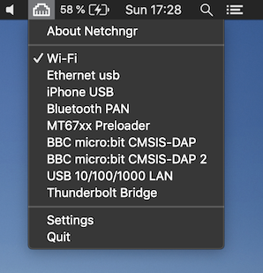
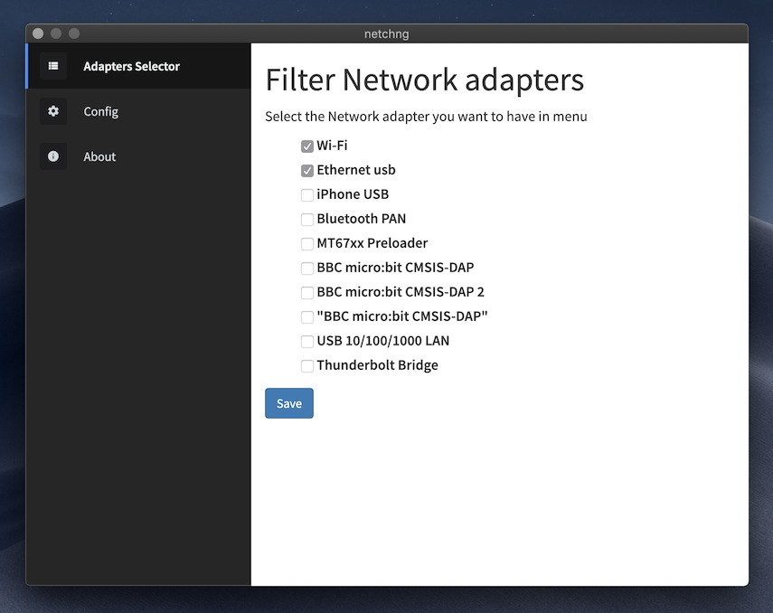
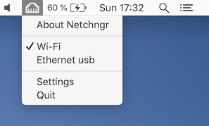

# NetChng

This app is still in development, use it at your own risk.

At work, I have two networks, the ethernet with access to intranet but limited internet. And the wifi with free internet access.

This app let you be connected to multiple networks and change which one is the first choice for macos.

Click the adapter you want to be the first one. 



You could config which adapters will be shown in the menu, and config start at login.



It supports macos light appearance too. 




### Install dependencies

``` js
$ yarn install
```

### Start in develop mode

``` js
$ yarn start
```

### Build app

``` js
$ yarn make
```
For local usage you could copy `out/netchng-darwin-x64/netchng.app` to your ´Applications´ folder.

For distribution purposes, a zip file named like `netchng-darwin-x64-x.x.x.zip` will be created in `out/make/zip/darwin/x64`
